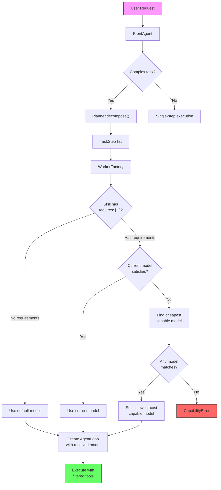
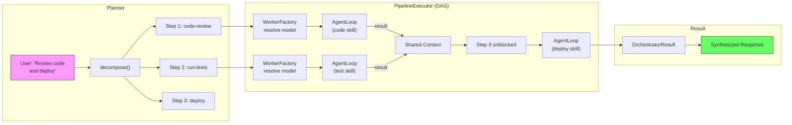
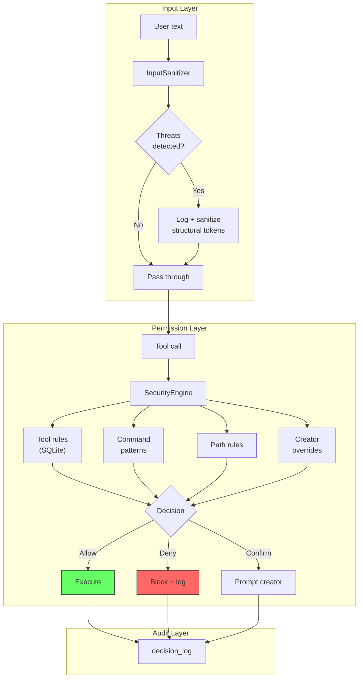

<div align="center">
  
  <h1>Meept</h1>
  <p><strong>Self-executing autonomous agent with hybrid memory, multi-frontend support, and skill-based task orchestration.</strong></p>
  <p>
    <code>pip install meept</code>
  </p>
</div>

---

Meept is a daemon-based AI agent framework that decomposes complex requests into skill-driven pipelines, selects the right model for each subtask via capability matching, and enforces security at every layer. It runs as a background process on your machine, accessible through a terminal TUI, Telegram, or a web interface.

## Features

- **Skill-based task decomposition** -- SKILL.md files define reusable agent behaviors with capability requirements, tool access, and risk levels
- **Capability-aware model selection** -- models declare capabilities (code, reasoning, tool_use); skills declare requirements; the resolver automatically picks the cheapest model that fits
- **Three-tier skill discovery** -- project-local, user-global, and system-wide skill directories with priority shadowing
- **ClawSkills (ClawHub integration)** -- install, update, and manage third-party skills from the [ClawHub](https://clawhub.ai) registry, all sandboxed with STRICT sanitization
- **DAG pipeline execution** -- multi-step tasks execute as dependency-resolved pipelines with per-step timeout, retry, and shared context
- **Collaborative planning** -- programming tasks get interactive plan-review-approve workflows with per-task git workspaces
- **Hybrid memory** -- episodic (conversation history), task (domain knowledge), and personality (self-model) memory with optional vector backends
- **Security-in-depth** -- SQLite-backed permission engine, input sanitization, tool-level gating, audit logging, and creator overrides
- **MCP integration** -- connect to local (stdio) and remote (HTTP/WebSocket) Model Context Protocol servers for external tool access
- **Multi-frontend** -- Textual TUI, Telegram bot, FastAPI web interface, and raw Unix socket JSON-RPC
- **Token budget management** -- sliding-window hourly limits, daily caps, RPM rate limiting, and configurable aggressiveness
- **Plugin system** -- extend with custom tools via the `Tool` ABC

## Architecture

```
                          meept (TUI)         Telegram         Web UI
                              |                  |                |
                              v                  v                v
                        +-----------+      +-----------+   +----------+
                        | CommServer|      | TG Bot    |   | FastAPI  |
                        | (Unix RPC)|      |           |   |          |
                        +-----------+      +-----------+   +----------+
                              \                  |              /
                               \                 |             /
                                +------> MessageBus <--------+
                                         (pub/sub)
                                            |
                      +---------------------+--------------------+
                      |                     |                    |
                      v                     v                    v
                 FrontAgent           Scheduler            MemoryManager
                      |              (APScheduler)        /     |      \
                      v                                 Episodic Task Personality
                 Orchestrator
                   |       \
        PipelineExecutor   WorkerFactory
           (DAG runner)        |
              |           ModelResolver
              v           (capability match)
         AgentLoop
         /    |    \
   LLMClient Tools SecurityEngine
              |
         ToolRegistry
        /     |      \
  Built-in  Skills   MCP
```

## Skill / Model Resolution

Skills declare what they need; models declare what they offer. The resolver bridges the two.



**SKILL.md format:**

```yaml
---
name: code-review
description: Automated code review with security focus
requires: [code, reasoning]
allowed-tools: [file_read, web_fetch]
risk-level: low
max-iterations: 5
temperature: 0.3
---

# Code Review

You are an expert code reviewer. Analyze the provided code for...
```

**models.json5 format:**

```json5
{
  model: "anthropic/claude-sonnet",
  small_model: "ollama/llama3.2",
  providers: {
    anthropic: {
      api: "openai",
      options: { baseURL: "https://api.anthropic.com/v1", apiKey: "${ANTHROPIC_API_KEY}" },
      models: {
        "claude-sonnet": {
          capabilities: ["code", "reasoning", "tool_use", "vision"],
          input_cost: 3.0,
          output_cost: 15.0,
          context_limit: 200000,
        },
      },
    },
  },
}
```

## Task Execution Pipeline

Multi-step tasks are decomposed into a DAG of pipeline steps with dependency tracking.



Each step:
1. **Resolves dependencies** -- waits for upstream steps to complete
2. **Creates a worker** -- WorkerFactory picks a model via capability matching and builds a filtered tool registry
3. **Executes in an AgentLoop** -- the LLM reasons, calls tools, and iterates until complete or capped
4. **Stores results** in shared context for downstream steps
5. **Reports progress** via the MessageBus

Features: per-step timeout, exponential-backoff retry, shared context passing, and bus-integrated progress events.

## ClawSkills -- Third-Party Skill Management

ClawSkills is an independent subsystem for managing skills from the [ClawHub](https://clawhub.ai) registry. All third-party skills are treated as **untrusted** with layered security.

```
meept clawskills search "code review"     # Search the registry
meept clawskills install gifgrep          # Download + validate + install
meept clawskills update --all             # Update all installed skills
meept clawskills list                     # Show installed skills
meept clawskills inspect gifgrep          # View remote detail
meept clawskills info gifgrep             # View local installed detail
meept clawskills remove gifgrep           # Uninstall
```

**Security layers:**

| Layer | What it does |
|-------|-------------|
| Archive validation | Rejects path traversal, forbidden files (.env, credentials.json), executable bits, non-whitelisted extensions, oversized files |
| STRICT sanitization | Runs all SKILL.md instructions through `InputSanitizer(STRICT)` -- catches prompt injection, role-switching, special token abuse |
| Tool filtering | Blocks `shell`, `file_write`, `file_delete`, `send_message` and tools matching `credential`, `secret`, `auth`, `password`, `token` |
| Risk enforcement | All clawskills get `risk_level="high"` regardless of frontmatter |
| Namespace isolation | `claw:` prefix prevents shadowing local skills |
| Iteration cap | Max 10 iterations, regardless of frontmatter |
| Slug blocklist | `blocked_slugs` in config to ban specific skills |
| Integrity tracking | SHA-256 of downloaded ZIP stored in `.origin.json` and `.lock.json` |

## Security Architecture

Meept implements defense-in-depth across every layer of the system.



**Risk levels**: SAFE < LOW < MEDIUM < HIGH < CRITICAL

| Action | Default Risk | Confirmation Required |
|--------|-------------|----------------------|
| file_read | SAFE | No |
| file_write | MEDIUM | No |
| file_delete | HIGH | Yes |
| shell_execute | MEDIUM (elevates for destructive commands) | Conditional |
| install_package | HIGH | Yes |
| system_modify | CRITICAL | Yes |

The `SecurityEngine` uses a SQLite database with seeded rules, creator overrides with expiry and use-count limits, and a full audit log of every decision.

## Memory System

Three memory types that integrate into every agent conversation.

| Type | Purpose | Backend |
|------|---------|---------|
| **Episodic** | Conversation history, interactions, feedback | Vector DB (memu) or SQLite+FTS5 |
| **Task** | Domain-specific technical knowledge (code, commands, deploy) | Vector DB (memvid) or SQLite+FTS5 |
| **Personality** | Self-model, communication style, creator preferences | Markdown file, optional LLM-driven evolution |

Before each LLM turn, the `MemoryManager` queries all three stores for relevant context and injects it into the conversation. Periodic consolidation merges episodic memories into long-term task knowledge.

## Communication Frontends

| Frontend | Protocol | Use Case |
|----------|----------|----------|
| **TUI** (`meept`) | Unix socket JSON-RPC | Interactive terminal chat |
| **Telegram** | Bot API | Mobile / remote access |
| **Web** | FastAPI + WebSocket | Browser-based interface |
| **Raw RPC** | Unix socket | Scripting and automation |

The internal `MessageBus` decouples all frontends from the agent pipeline via async pub/sub with wildcard topic support.

**JSON-RPC methods:** `chat`, `status`, `memory.query`, `memory.export`, `scheduler.list_jobs`, `scheduler.add_job`, `scheduler.schedule_agent_task`, `config.reload`, `security.query_log`, `security.get_stats`, `security.record_override`, `skills.list`, `skills.triage`, `pipeline.status`

## Configuration

All configuration lives in `~/.meept/meept.toml` with model definitions in `config/models.json5`.

```toml
[daemon]
socket_path = "~/.meept/meept.sock"
log_level = "INFO"

[llm.budget]
hourly_token_limit = 100000
daily_token_limit = 1000000
rate_limit_rpm = 30
aggressiveness = 0.5    # 0.0 = conservative, 1.0 = use full budget

[security]
sanitize_inputs = true
require_confirmation_high = true
require_confirmation_critical = true
allowed_paths = ["~/*"]
blocked_paths = ["~/.ssh/*", "~/.gnupg/*"]

[skills]
enabled = true

[clawskills]
enabled = false
registry_url = "https://clawhub.ai"
install_dir = "~/.meept/clawskills"
blocked_slugs = []

[memory]
data_dir = "~/.meept/memory"

[scheduler]
enabled = true
timezone = "UTC"

[workspace]
enabled = true
base_dir = "~/.meept/workspaces"
auto_commit = true
```

## Project Structure

```
src/meept/
  agent/          # FrontAgent, Orchestrator, WorkerFactory, AgentLoop, Planner, Workspace
  clawskills/     # ClawHub client, installer, security adapter, index, CLI
  comm/           # CommServer (JSON-RPC), Telegram bot, Web (FastAPI)
  core/           # Daemon lifecycle, Registry (DI), Config, MessageBus
  llm/            # Provider abstraction, ModelResolver, TokenBudget, client
  memory/         # Episodic, Task, Personality memory + MemoryManager
  models/         # Pydantic config schema, message types, memory types
  scheduler/      # PipelineExecutor (DAG), MeeptScheduler (APScheduler)
  security/       # SecurityEngine (SQLite), InputSanitizer, PermissionManager
  skills/         # SkillIndex (3-tier discovery), parser, registry, models
  tools/          # Tool ABC, ToolRegistry, built-in tools, MCP manager

cli/              # Textual TUI application
config/           # Default meept.toml + models.json5
plugins/          # Plugin system with example
tests/            # 395 tests across 37 modules
```

## Installation

```bash
# Core
pip install meept

# With optional backends
pip install meept[memory]      # Vector memory (memu, memvid)
pip install meept[telegram]    # Telegram bot
pip install meept[web]         # FastAPI web frontend
pip install meept[cli]         # Textual TUI
```

## Quick Start

```bash
# 1. Start the daemon
meept-daemon --foreground

# 2. In another terminal, launch the TUI
meept

# 3. Or use clawskills without the daemon
meept clawskills search "code review"
meept clawskills install gifgrep
```

## Skill Discovery Hierarchy

```
.meept/skills/              # Project-local (highest priority)
~/.meept/skills/            # User-global
~/.config/meept/skills/     # System-wide (lowest priority)
~/.meept/clawskills/        # Third-party from ClawHub (claw: prefix)
```

Higher-priority tiers shadow same-named skills in lower tiers. ClawSkills use a `claw:` namespace prefix and cannot shadow local skills.

## Testing

```bash
# Run all tests
pytest tests/ -v

# Run only clawskills tests
pytest tests/test_clawskills/ -v

# Current coverage: 395 tests, 2 skipped, 0 failures
```

| Test Area | Modules |
|-----------|---------|
| Agent | front, orchestrator, worker_factory, collaborative_planner, workspace |
| Skills | discovery, models, parser, registry, tool_filter, dispatcher, executor |
| ClawSkills | client, index, installer, models, security, cli |
| LLM | models, providers_json5, resolver, budget |
| Security | engine, permissions, sanitizer |
| Memory | episodic |
| Tools | interface, mcp_auth, mcp_remote, schedule_tool, skill_tools |
| Scheduler | pipelines, scheduler |
| Communication | protocol |
| Core | bus, config, registry |

## Dependencies

| Package | Purpose |
|---------|---------|
| `httpx` | Async HTTP (ClawHub API, LLM providers, MCP) |
| `pydantic` | Config schema validation |
| `pyyaml` | SKILL.md frontmatter parsing |
| `aiosqlite` | Security engine + memory persistence |
| `apscheduler` | Job scheduling (optional, has asyncio fallback) |
| `cryptography` | TLS support |

## License

MIT
