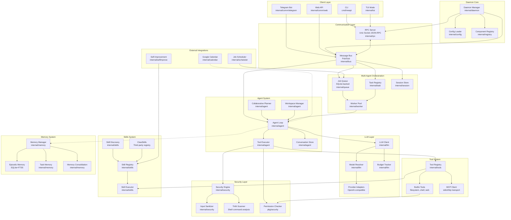
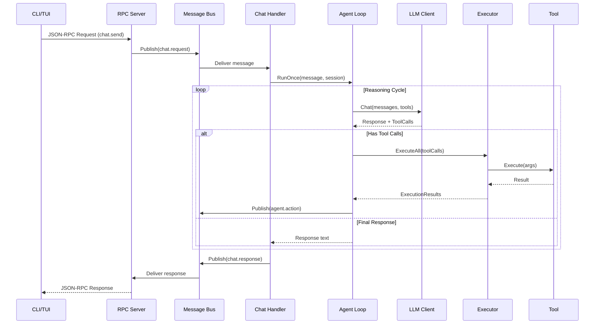
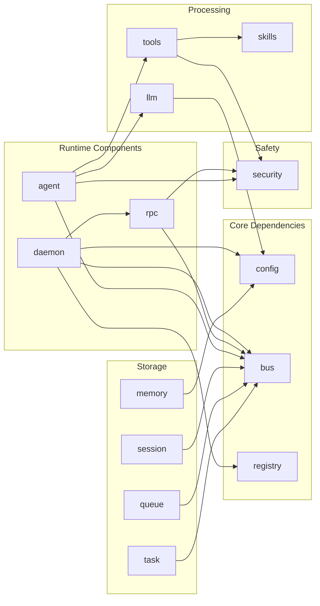
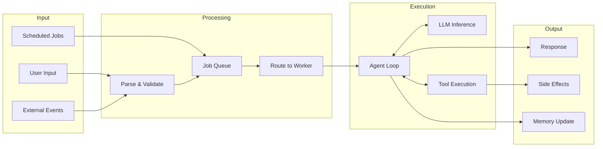
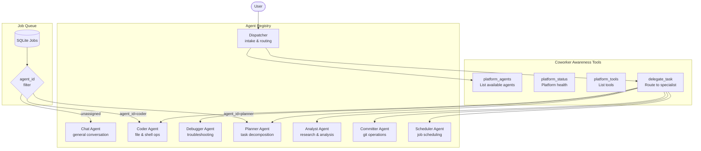

# Meept Architecture Diagram

## System Overview

## Request Flow

## Component Dependencies

## Data Flow

## Multi-Agent Orchestration

### Agent Types

| ID | Role | Purpose | Additional Tools |
|----|------|---------|------------------|
| `dispatcher` | Dispatcher | Intake, classify, route requests | `delegate_task` |
| `chat` | Executor | General conversation | `web_fetch` |
| `coder` | Executor | File ops, shell, coding | `file_*`, `shell_execute` |
| `debugger` | Executor | Troubleshooting, bug fixing | `file_*`, `shell_execute` |
| `planner` | Executor | Task decomposition, planning | - |
| `analyst` | Executor | Research, data analysis | `web_fetch` |
| `committer` | Executor | Git operations | `shell_execute` |
| `scheduler` | Executor | Job scheduling | - |

### Task Pickup Flow

Two paths exist for agents to receive work:

1. **Synchronous (Chat Handler)**: User → RPC → MessageBus → `chat.request` → Agent Loop
2. **Asynchronous (Job Queue)**: Job → SQLite Queue → Worker Pool → Agent by `agent_id`

Jobs specify `agent_id` to target a specific agent. Unassigned jobs can be claimed by any agent matching required capabilities.

## Package Structure

| Layer | Packages | Description |
|-------|----------|-------------|
| **Entry** | `cmd/meept`, `cmd/meept-daemon` | CLI and daemon entry points |
| **Server** | `internal/daemon`, `internal/rpc`, `internal/bus` | Daemon lifecycle, RPC, messaging |
| **Agent** | `internal/agent` | Agent loop, executor, conversation, planner, registry |
| **Orchestration** | `internal/queue`, `internal/task`, `internal/worker`, `internal/session` | Multi-agent job orchestration |
| **LLM** | `internal/llm` | Client, resolver, budget, providers |
| **Tools** | `internal/tools`, `internal/tools/builtin`, `internal/tools/mcp` | Tool registry and implementations |
| **Skills** | `internal/skills`, `internal/clawskills` | Skill discovery, parsing, execution |
| **Security** | `internal/security`, `pkg/security` | Permission checking, sanitization |
| **Memory** | `internal/memory` | Episodic, task, consolidation |
| **External** | `internal/comm/*`, `internal/calendar`, `internal/scheduler` | External integrations |
| **Self-Improve** | `internal/selfimprove` | Autonomous improvement system |
