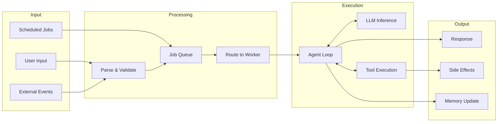

# Architecture

Meept is a Go daemon with a layered architecture: client interfaces connect through an RPC layer to a message bus, which routes messages to agent loops that use LLM inference and tool execution.

## System Overview

```mermaid
flowchart TB
    subgraph Clients["Client Layer"]
        CLI["CLI<br/>cmd/meept"]
        TUI["TUI Mode<br/>internal/tui"]
        Telegram["Telegram Bot<br/>internal/comm/telegram"]
        WebUI["Web API<br/>internal/comm/web"]
        MenuBar["MenuBar App<br/>menubar/"]
        FlutterUI["Flutter UI<br/>via WebSocket"]
        AIAgent["AI Agents<br/>via MCP"]
    end

    subgraph Daemon["Daemon Core"]
        DaemonMgr["Daemon Manager<br/>internal/daemon"]
        Config["Config Loader<br/>internal/config"]
        Registry["Component Registry<br/>internal/registry"]
    end

    subgraph Communication["Communication Layer"]
        RPC["RPC Server<br/>Unix Socket JSON-RPC<br/>internal/rpc"]
        HTTP["HTTP Server<br/>REST + WebSocket + MCP/SSE<br/>internal/comm/http"]
        Bus["Message Bus<br/>Pub/Sub<br/>internal/bus"]
    end

    subgraph Agent["Agent System"]
        AgentLoop["Agent Loop<br/>internal/agent"]
        Executor["Tool Executor<br/>internal/agent"]
        Conversation["Conversation Store<br/>internal/agent"]
        Planner["Collaborative Planner<br/>internal/agent"]
        Workspace["Workspace Manager<br/>internal/agent"]
    end

    subgraph Plans["Plan System"]
        PlanMgr["Plan Manager<br/>internal/plan"]
        PlanStore["Plan Store<br/>SQLite"]
        PlanParser["Plan Parser/Writer<br/>plan.md"]
    end

    subgraph LLM["LLM Layer"]
        LLMClient["LLM Client<br/>internal/llm"]
        Resolver["Model Resolver<br/>internal/llm"]
        Budget["Budget Tracker<br/>internal/llm"]
        TokenCache["Token Cache<br/>internal/llm (L1+L2)"]
        Providers["Provider Adapters<br/>OpenAI-compatible"]
        Compactor["Context Compactor<br/>internal/llm"]
        Firewall["Context Firewall<br/>internal/llm"]
    end

    subgraph Tools["Tool System"]
        ToolReg["Tool Registry<br/>internal/tools"]
        BuiltinTools["Builtin Tools<br/>filesystem, shell, web"]
        MCPClient["MCP Client<br/>stdio/http transport"]
    end

    subgraph Security["Security Layer"]
        SecEngine["Security Engine<br/>internal/security"]
        Sanitizer["Input Sanitizer<br/>internal/security"]
        Tirith["Tirith Scanner<br/>Shell command analysis"]
    end

    subgraph Memory["Memory System"]
        MemMgr["Memory Manager<br/>internal/memory"]
        Episodic["Episodic Memory<br/>SQLite+FTS5"]
        TaskMem["Task Memory<br/>internal/memory"]
        Consolidation["Memory Consolidation<br/>internal/memory"]
    end

    CLI --> RPC
    TUI --> RPC
    MenuBar --> HTTP
    FlutterUI --> HTTP
    AIAgent --> HTTP
    Telegram --> Bus
    WebUI --> Bus

    DaemonMgr --> Config
    DaemonMgr --> Registry
    DaemonMgr --> RPC
    DaemonMgr --> HTTP
    DaemonMgr --> Bus

    RPC <--> Bus
    HTTP <--> Bus
    Bus --> AgentLoop

    AgentLoop --> Executor
    AgentLoop --> Conversation
    AgentLoop --> LLMClient
    AgentLoop --> PlanMgr
    PlanMgr --> PlanStore
    PlanMgr --> PlanParser
    Executor --> ToolReg
    Executor --> SecEngine
    ToolReg --> BuiltinTools
    ToolReg --> MCPClient

    LLMClient --> Resolver
    LLMClient --> Budget
    Resolver --> Providers
    AgentLoop --> Firewall
    Firewall --> Compactor

    MemMgr --> Episodic
    MemMgr --> TaskMem
    MemMgr --> Consolidation
    AgentLoop -.-> MemMgr

    SecEngine --> Sanitizer
    SecEngine --> Tirith
```

## Component Layers

### Entry Points

| Component | Package | Description |
|-----------|---------|-------------|
| CLI | `cmd/meept` | Command-line client |
| Daemon | `cmd/meept-daemon` | Background daemon process |
| TUI | `internal/tui` | Bubble Tea interactive terminal UI |

### Client-Side Services

| Component | Package | Description |
|-----------|---------|-------------|
| Speech-to-Text | `internal/stt` | Client-side voice transcription (whisper, parakeet, native engines) |

### Communication

| Component | Package | Description |
|-----------|---------|-------------|
| RPC Server | `internal/rpc` | Unix socket JSON-RPC server |
| HTTP Server | `internal/comm/http` | REST API, WebSocket, MCP over HTTP+SSE |
| Message Bus | `internal/bus` | Pub/sub message routing |

### Agent System

| Component | Package | Description |
|-----------|---------|-------------|
| Agent Loop | `internal/agent` | Core reasoning loop with tool use |
| Tool Executor | `internal/agent` | Permission-checked tool execution |
| Conversation | `internal/agent` | Persistent session management |
| Planner | `internal/agent` | Task decomposition and collaborative review |
| Workspace | `internal/agent` | Git-backed task tracking |
| Reflection Engine | `internal/agent` | Auto lint/test validation after code edits |

### Orchestration

| Component | Package | Description |
|-----------|---------|-------------|
| Job Queue | `internal/queue` | SQLite-backed job queue |
| Worker Pool | `internal/worker` | Multi-agent worker management |
| Session Store | `internal/session` | Persistent session state |

### Support Systems

| Component | Package | Description |
|-----------|---------|-------------|
| LLM Client | `internal/llm` | Multi-provider LLM integration |
| Plan System | `internal/plan` | Plan lifecycle, synthesis into tasks, progress tracking |
| Context Compactor | `internal/llm` | LLM-based context compaction (knowledge-preserving summarization) |
| Context Firewall | `internal/llm` | Three-layer context management (compaction, compression, hard limit) |
| Token Cache | `internal/llm` | L1+L2 response caching with file-aware invalidation |
| Tool Registry | `internal/tools` | Tool registration and dispatch |
| Security | `internal/security` | Sanitization, taint tracking, permissions |
| Memory | `internal/memory` | Multi-tier memory with FTS5 |
| Skills | `internal/skills` | Skill discovery and execution |
| Scheduler | `internal/scheduler` | Cron-based job scheduling |
| Metrics | `internal/metrics` | SQLite time-series storage, model performance aggregation, error records |

## Data Flow

## Key Design Decisions

1. **Daemon model** — Meept runs as a persistent process, not a per-session CLI. This enables job scheduling, persistent memory, and multi-session state.

2. **Message bus** — All communication between components goes through a pub/sub bus. This decouples components and enables easy extension.

3. **Multi-agent routing** — Rather than one agent doing everything, specialist agents handle different task types. The dispatcher classifies and routes.

4. **SQLite backbone** — Job queue, memory, audit logs, and metrics all use SQLite for zero-dependency persistence.

5. **OpenAI-compatible API** — LLM providers all use the OpenAI chat completion format, making it easy to add new providers.

6. **Client-side STT** — Speech-to-text runs entirely in the client (TUI or Flutter), not through the daemon. The `internal/stt` package provides a `Transcriber` interface with pluggable engines (whisper, parakeet, native). Recording and transcription happen locally; only the resulting text is sent to the daemon as a normal chat message.
