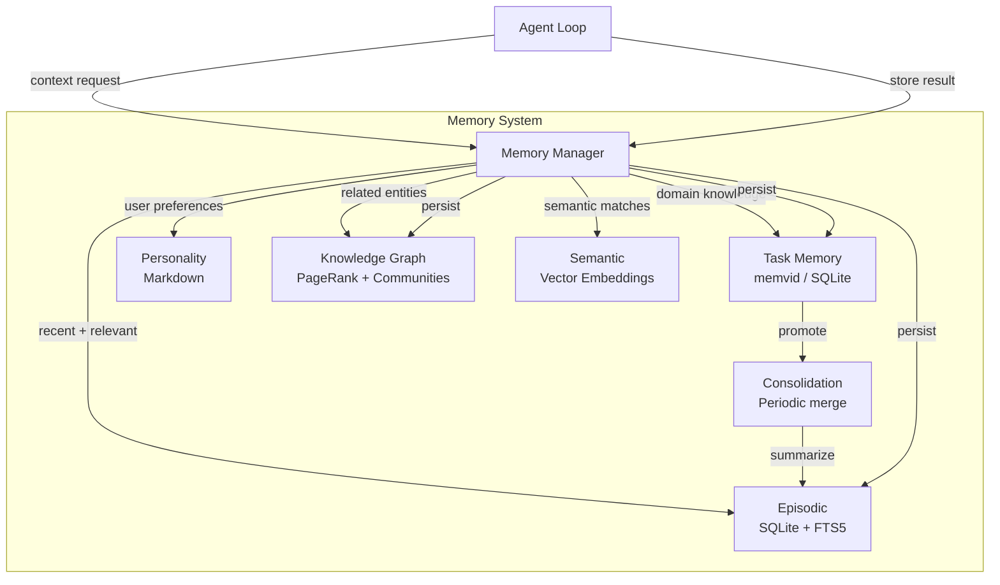

# Memory

Meept implements a multi-tiered memory architecture with different storage backends, query modes, and consolidation strategies.

## Memory Types

### Episodic Memory

Stores conversation and interaction history.

- **Backend**: SQLite with FTS5 full-text search
- **Ranking**: BM25 for keyword relevance
- **Injection**: Automatically injected into agent context based on recency and relevance
- **Configuration**: `[memory.episodic]`

```toml
[memory.episodic]
enabled = true
max_context_items = 20
```

### Task Memory

Stores domain-specific technical knowledge organized by domain.

- **Domains**: `general`, `code`, `commands` (configurable)
- **Backend**: memvid (primary) or SQLite (fallback)
- **Consolidation**: Promoted to episodic memory over time

```toml
[memory.task]
enabled = true
domains = ["general", "code", "commands"]
```

### Personality Memory

Tracks user preferences across conversations.

- **Backend**: Markdown files
- **Update frequency**: Every N conversations (configurable)
- **Effect**: Influences response style and behavior

```toml
[memory.personality]
enabled = true
update_interval_conversations = 10
```

### Knowledge Graph

Entity-centric memory with relationships and importance scoring.

- **Relations**: `reference`, `similar`, `temporal`, `co_accessed`, `causal`
- **Scoring**: PageRank-based importance
- **Clustering**: Community detection for grouping related entities
- **Tools**: `entity_create`, `entity_link`, `entity_query`, `graph_stats`

### Semantic Memory (Vector Embeddings)

Vector similarity search using embeddings for semantic recall.

- **Providers**: OpenAI or Ollama embedding models
- **Search**: Hybrid — combines keyword (FTS) and vector (cosine similarity) scores
- **Alpha parameter**: 0 = pure keyword, 1 = pure vector (default 0.5)

```toml
[memory.embeddings]
enabled = true
provider = "openai"  # or "ollama"
api_key = "sk-..."
model = "text-embedding-3-small"
dimension = 1536
```

### Distributed Memory (memvid)

2-tier architecture for multi-agent memory sharing.

- **Local**: SQLite database per daemon instance
- **Shared**: memvid service for cross-instance memory
- **Hydration**: Fetch relevant memories when a job is claimed
- **Distillation**: Promote important memories to shared storage

```toml
[distributed_memory]
enabled = false
mode = "distributed"

[distributed_memory.sync]
hydrate_on_claim = true
hydration_limit = 20
distill_on_complete = true
```

## Memory Architecture



## Memory Operations

### Storing

```bash
# Via agent conversation
You: "Remember that I prefer Go for backend services"

# Via CLI
./bin/meept memory search "backend services"
```

### Searching

Memories are searched using FTS5 keyword matching, vector similarity, or hybrid:

- **Keyword**: BM25 ranking over FTS5 index
- **Vector**: Cosine similarity over embeddings
- **Hybrid**: Weighted combination (alpha parameter)

### Consolidation

Periodic process that:
1. Archives old episodic memories
2. Creates summary memories
3. Removes duplicate task memories
4. Expires rarely-accessed memories

```toml
[memory]
consolidation_interval_hours = 6
```

## Memory Query

```go
type MemoryQuery struct {
    Query       string     // Free-text search string
    Type        MemoryType // Restrict to subsystem
    Category    string     // Restrict to category
    Domain      string     // Restrict task memories
    Limit       int        // Max results
    MinRelevance float64   // Discard low-scoring results
}
```

## Configuration Reference

```toml
[memory]
data_dir = "~/.meept/memory"
consolidation_interval_hours = 6

[memory.episodic]
enabled = true
max_context_items = 20

[memory.task]
enabled = true
domains = ["general", "code", "commands"]

[memory.personality]
enabled = true
update_interval_conversations = 10
```

See [Memory System](../workflows/memory.md) for the full feature specification.
