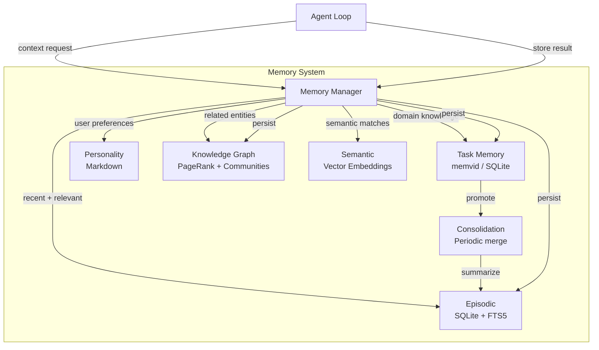

# Memory

Meept implements a multi-tiered memory architecture with different storage backends, query modes, and consolidation strategies.

## Memory Types

### Episodic Memory

Stores conversation and interaction history.

- **Backend**: SQLite with FTS5 full-text search
- **Ranking**: BM25 for keyword relevance
- **Injection**: Automatically injected into agent context based on recency and relevance
- **Configuration**: `[memory.episodic]`

```toml
[memory.episodic]
enabled = true
max_context_items = 20
```

### Task Memory

Stores domain-specific technical knowledge organized by domain.

- **Domains**: `general`, `code`, `commands` (configurable)
- **Backend**: memvid (primary) or SQLite (fallback)
- **Consolidation**: Promoted to episodic memory over time

```toml
[memory.task]
enabled = true
domains = ["general", "code", "commands"]
```

### Personality Memory

Tracks user preferences across conversations.

- **Backend**: Markdown files
- **Update frequency**: Every N conversations (configurable)
- **Effect**: Influences response style and behavior

```toml
[memory.personality]
enabled = true
update_interval_conversations = 10
```

### Knowledge Graph

Entity-centric memory with relationships and importance scoring.

- **Relations**: `reference`, `similar`, `temporal`, `co_accessed`, `causal`
- **Scoring**: PageRank-based importance
- **Clustering**: Community detection for grouping related entities
- **Tools**: `entity_create`, `entity_link`, `entity_query`, `graph_stats`

### Semantic Memory (Vector Embeddings)

Vector similarity search using embeddings for semantic recall.

- **Providers**: OpenAI or Ollama embedding models
- **Search**: Hybrid — combines keyword (FTS) and vector (cosine similarity) scores
- **Alpha parameter**: 0 = pure keyword, 1 = pure vector (default 0.5)

```toml
[memory.embeddings]
enabled = true
provider = "openai"  # or "ollama"
api_key = "sk-..."
model = "text-embedding-3-small"
dimension = 1536
```

### Distributed Memory (memvid)

2-tier architecture for multi-agent memory sharing.

- **Local**: SQLite database per daemon instance
- **Shared**: memvid service for cross-instance memory
- **Hydration**: Fetch relevant memories when a job is claimed
- **Distillation**: Promote important memories to shared storage

```toml
[distributed_memory]
enabled = false
mode = "distributed"

[distributed_memory.sync]
hydrate_on_claim = true
hydration_limit = 20
distill_on_complete = true
```

## Memory Architecture



## Memory Operations

### Storing

```bash
# Via agent conversation
You: "Remember that I prefer Go for backend services"

# Via CLI
./bin/meept memory search "backend services"
```

### Searching

Memories are searched using FTS5 keyword matching, vector similarity, or hybrid:

- **Keyword**: BM25 ranking over FTS5 index
- **Vector**: Cosine similarity over embeddings
- **Hybrid**: Weighted combination (alpha parameter)

### Consolidation

Periodic process that:
1. Archives old episodic memories
2. Creates summary memories
3. Removes duplicate task memories
4. Expires rarely-accessed memories

```toml
[memory]
consolidation_interval_hours = 6
```

## Memory Query

```go
type MemoryQuery struct {
    Query       string     // Free-text search string
    Type        MemoryType // Restrict to subsystem
    Category    string     // Restrict to category
    Domain      string     // Restrict task memories
    Limit       int        // Max results
    MinRelevance float64   // Discard low-scoring results
}
```

## Configuration Reference

```toml
[memory]
data_dir = "~/.meept/memory"
consolidation_interval_hours = 6

[memory.episodic]
enabled = true
max_context_items = 20

[memory.task]
enabled = true
domains = ["general", "code", "commands"]

[memory.personality]
enabled = true
update_interval_conversations = 10
```

## Epistemic Memory

Epistemic memory extends the platform with structured, truth-maintained knowledge: claims, decisions, predictions, and open questions, plus typed relationships between them. Where episodic memory answers "what happened," epistemic memory answers "what do we believe, why, and how has it changed."

### Epistemic memory types

| Type | Constant | Purpose |
|------|----------|---------|
| Claim | `MemoryTypeClaim` | A structured assertion of belief with source, confidence, and tags |
| Decision | `MemoryTypeDecision` | A recorded call with alternatives considered, expected outcome, and optional review schedule |
| Prediction | `MemoryTypePrediction` | A forecast with a resolution horizon and tracked outcome |
| Question | `MemoryTypeQuestion` | An open question the user is tracking, optionally linked to relevant claims |

These reuse the existing `episodic_memories` table — the Go-level `Type` discriminates them for tool routing and detection, and `Category` provides finer-grained labeling. No schema migration is required.

### Epistemic edge types

Edges live in the existing `memory_edges` table (TEXT `edge_type` column) and are typed by `EdgeType` constants in `internal/memory/graph.go`:

| Edge | Constant | Semantics |
|------|----------|-----------|
| `contradicts` | `EdgeTypeContradicts` | Newer memory directly asserts the opposite of the older one |
| `superseded` | `EdgeTypeSuperseded` | Older memory is no longer the current belief; edges redirected to the new memory |
| `evidence_for` | `EdgeTypeEvidenceFor` | Source memory supports the target claim |
| `evidence_against` | `EdgeTypeEvidenceAgainst` | Source memory undermines the target claim |
| `derives_from` | `EdgeTypeDerivesFrom` | Target claim was inferred from the source memory |
| `supports` | `EdgeTypeSupports` | General reinforcement (weaker than `evidence_for`) |
| `potential_contradicts` | `EdgeTypePotentialContradicts` | Low-confidence contradiction candidate queued for review; does not propagate to ranking or destructive actions |

### Trust-graded claim status

Every claim carries a `status` in its `Metadata`. The `ClaimStatus` enum (`internal/memory/epistemic.go`) determines trust weight and what the claim is allowed to do:

| Status | Constant | Trust weight | Eligible as canonical? |
|--------|----------|--------------|------------------------|
| `confirmed` | `ClaimStatusConfirmed` | 1.0 | yes |
| `promoted` | `ClaimStatusPromoted` | 1.0 | yes |
| `auto` | `ClaimStatusAuto` | configurable (default 0.5) | no |
| `rejected` | `ClaimStatusRejected` | 0.0 (excluded from queries) | no |

Trust weight propagates to search ranking, edge confidence (`edge weight × min(source trust, target trust)`), PageRank computation (rejected claims excluded; auto claims weighted), and permissions: an `auto` claim cannot supersede a `confirmed` one. TUI and GUI render an "(auto)" badge for `auto` claims.

### Creation paths

Epistemic memories enter the system through four paths:

| Path | Writes status | Description |
|------|---------------|-------------|
| A. Explicit tools | `confirmed` | `retain_claim`, `retain_decision`, `retain_prediction` tools write user-asserted memories with full trust |
| B. Ambient extraction | `auto` | Opt-in post-turn LLM classifier scans recent conversation and writes low-trust candidates (off by default; configurable rate limit, intent exclusions, and category exclusions) |
| C. Backlog mining | `auto` | Librarian walks old episodic memory in batches, runs the same classifier, and surfaces candidates for promotion |
| D. Reflection surfacing | `auto` | `reflect` identifies assertions in recent conversation that have not been recorded and surfaces them as "record as claim?" prompts |

Paths B, C, and D all write `auto` claims and feed into a single promotion surface where the user can promote (→ `promoted`, weight 1.0), reject (→ `rejected`), edit-then-promote, or skip (resurfaces next cycle).

### Relationship detection

The `EpistemicDetector` (`internal/memory/epistemic_detection.go`) identifies relationships between memories using embedding similarity plus LLM classification. The pipeline embeds the new memory, finds the top-K similar confirmed/promoted claims (auto claims excluded as targets to avoid noise), and asks the LLM to classify each pair as `contradicts`, `superseded`, `evidence_for`, `evidence_against`, `derives_from`, `supports`, or `unrelated`, returning JSON with confidence scores. Candidates below `DetectionThreshold` (default 0.7) are dropped.

Detection runs in two places:

1. **Per-Store hook** — fires when `Manager.Store` writes a memory whose type is one of Claim, Decision, Prediction, or Question.
2. **Consolidator periodic pass** — `Consolidator.Run` walks all epistemic memories added since the last run, catching relationships the per-store hook missed (for example, when the comparison set changes). The count is reported via `ConsolidationReport.EpistemicEdgesDetected`.

Low-confidence contradiction candidates (between `PotentialContradictionThreshold` = 0.4 and `DetectionThreshold`) are written as `potential_contradicts` edges with low weight (0.2). They surface in reflection output and librarian prompts as "potential contradictions to review" but never propagate to search ranking or destructive actions.

### Two-phase confirmation protocol

Destructive epistemic actions use a shared confirmation contract. The tool returns a preview response with `requires_confirmation: true`; the UI surface (CLI/TUI/GUI) intercepts, prompts the user, and re-invokes the tool with `confirmed: true`. Helpers live in `internal/tools/builtin/confirmation.go` (`ConfirmationResponse`, `IsConfirmationRequest`, `DeclineResponse`).

Destructive tools:

| Tool | Reversible | What it changes |
|------|------------|-----------------|
| `mark_superseded` | yes | Flips `is_current=0` on the old memory; redirects incoming evidence edges to the new memory; writes a `superseded` edge |
| `mark_resolved` | no | Closes a prediction with an outcome |
| `record_review` | no | Closes a decision with the actual outcome and scores expected-vs-actual |
| `reject_claim` | yes | Sets status=rejected |
| `purge_auto_claims` | no | Bulk delete auto claims matching a filter |

Auto-detected candidates never auto-supersede — they queue as `potential_contradicts` and require explicit user confirmation to promote.

### See also

- [Epistemic Memory configuration](../configuration/epistemic-memory.md) — every config field with default, range, and example
- [Multi-Agent: Epistemic Memory Integration](multi-agent.md#epistemic-memory-integration) — how `librarian` (memory steward) and `skeptic` (contradiction hunter) consume and curate epistemic memory

See [Memory System](../workflows/memory.md) for the full feature specification.
