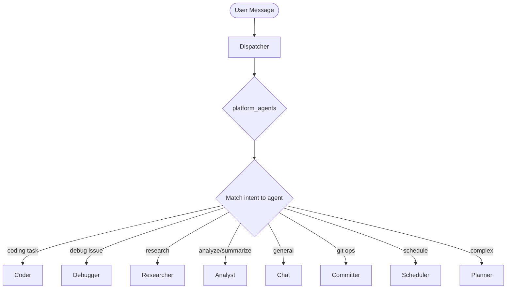

# Multi-Agent System

Meept uses a multi-agent architecture where specialist agents handle different types of tasks. A dispatcher classifies incoming requests and routes them to the most appropriate agent.

## Agent Types

### Roles

| Role | Description |
|------|-------------|
| `dispatcher` | Intake agent that classifies and routes requests |
| `executor` | Specialist agent that executes specific task types |
| `reviewer` | Validation agent that reviews and approves work |

### Executor Agents

| Agent ID | Purpose | Additional Tools |
|----------|---------|------------------|
| `chat` | General conversation | `web_fetch`, `web_search` |
| `coder` | File ops, shell, coding | `file_read`, `file_write`, `file_delete`, `list_directory`, `shell_execute`, `request_handoff` |
| `debugger` | Troubleshooting, bug fixing | `file_read`, `file_write`, `shell_execute`, `request_handoff` |
| `planner` | Task decomposition, planning | (baseline only) |
| `analyst` | Synthesizes information, draws insights, summarizes | `web_fetch`, `web_search`, `file_read`, `list_directory`, `request_handoff` |
| `researcher` | Gathers information from web, documentation, codebase | `web_fetch`, `web_search`, `file_read`, `list_directory` |
| `committer` | Git operations | `shell_execute` |
| `scheduler` | Job scheduling | `schedule_create`, `schedule_list`, `schedule_delete` |
| `writer` | Long-form writing (essays, docs, briefs) | `file_read`, `file_write`, `request_handoff` |
| `architect` | System design, tech evaluation, trade-off analysis | `file_read`, `list_directory`, `request_handoff` |
| `skeptic` | Stress-tests claims, surfaces contradictions | `memory_search`, `file_read`, `request_handoff` |
| `librarian` | Memory steward — reflection, tag hygiene, epistemic integrity | `memory_store`, `memory_search`, `request_handoff` |

### Reviewer Agents

Reviewers are first-class agents defined by `AGENT.md` files (same discovery hierarchy as executors). Each reviewer declares a `reviews_domain` (e.g., `code`, `test`, `debug`, `analysis`, `plan`) that the dispatcher uses to route review work.

| Agent ID | Reviews |
|----------|---------|
| `code-reviewer` | Code changes from the coder agent (`reviews_domain: code`) |
| `test-reviewer` | Test results and verification (`reviews_domain: test`) |
| `debug-reviewer` | Debugging analysis and fixes (`reviews_domain: debug`) |
| `analyst-reviewer` | Analysis work (`reviews_domain: analysis`) |
| `planner-reviewer` | Execution plans (`reviews_domain: plan`) |

## Epistemic Memory Integration

The `librarian` and `skeptic` agents are built on Plan 1's epistemic memory platform.

- **librarian** drives the reflection, tag hygiene, backlog mining, and auto-claim promotion pipeline. It surfaces candidates to the user for action.
- **skeptic** consumes `contradicts`, `superseded`, and `evidence_against` edges to stress-test user claims against stored knowledge.

Both agents defer all destructive actions (supersede, reject, promote) to explicit user confirmation.

## Baseline Tools

All agents have access to these tools regardless of specialization:

| Tool | Description |
|------|-------------|
| `memory_store` | Store a memory |
| `memory_search` | Search memories |
| `memory_get_context` | Get relevant context |
| `task_create` | Create a task |
| `task_get` | Get task by ID |
| `task_list` | List tasks |
| `task_update` | Update a task |
| `platform_status` | Get system status |
| `platform_agents` | List available agents |
| `platform_tools` | List registered tools |
| `delegate_task` | Route task to specific agent |

## Agent Constraints

Each agent has operational limits:

| Constraint | Default | Description |
|------------|---------|-------------|
| `max_iterations` | 25 | Maximum reasoning cycles per request |
| `timeout` | 5m | Maximum duration per request |
| `max_tokens_per_turn` | 4096 | Maximum tokens to generate per turn |
| `max_memory_refs` | 20 | Maximum memory references to inject |

The dispatcher has tighter constraints (5 iterations, 60s timeout) since it only routes, doesn't execute.

## Agent Customization

### AGENT.md Files

Agents can be customized using `AGENT.md` files with YAML frontmatter:

```yaml
---
id: coder
name: Code Specialist
role: executor
additional_tools:
  - file_read
  - file_write
capabilities:
  - code
  - reasoning
max_iterations: 20
timeout_seconds: 600
temperature: 0.1
---
# Custom Coder Instructions
Always add type annotations. Prefer functional style.
```

### Discovery Hierarchy (highest priority first)

1. `.meept/agents/<id>/AGENT.md` — Project-local
2. `~/.meept/agents/<id>/AGENT.md` — User-global
3. `~/.config/meept/agents/<id>/AGENT.md` — System-wide
4. `config/agents/` — Bundled defaults

### Merge Behavior

- Non-empty AGENT.md fields **override** programmatic defaults
- Empty fields inherit from defaults
- Tools are **merged** (union), not replaced

### RULES.md

A global `RULES.md` can inject behavior requirements into all agents:

**Discovery:** `.meept/RULES.md` > `~/.meept/RULES.md` > embedded default

Rules require agents to return structured JSON reports:
```json
{
  "status": "completed|partial|failed|needs_input",
  "accomplished": ["what you completed"],
  "not_done": ["what remains"],
  "issues": ["problems encountered"],
  "suggested_next_agent": "agent-id",
  "user_decision_needed": true
}
```

## Coworker Awareness

Agents discover each other using platform tools:

- `platform_agents` — List all registered agents with capabilities
- `platform_status` — Get platform health and uptime
- `platform_tools` — List all registered tools
- `delegate_task` — Route a task to a specific agent (synchronous, blocking)
- `request_handoff` — Dynamically inject a new step into the running task DAG and route to another agent (async, non-blocking)

### Dynamic Agent Handoff

The `request_handoff` tool allows an agent executing within the orchestrator pipeline to dynamically inject a new step and re-route to another agent mid-task, without going through the dispatcher or waiting for the full DAG to complete.

| | `delegate_task` | `request_handoff` |
|---|---|---|
| Execution | Synchronous (caller waits) | Async (caller continues) |
| DAG integration | None | Creates real step with dependencies |
| Validation/review | Bypassed | Subject to existing gates |
| Audit trail | None | Step + amendment record |
| Context | Ad-hoc string | Full AccumulatedContext propagation |
| Retry/escalation | None | Inherited from TacticalScheduler |

**Handoff flow:**
```
Agent calls request_handoff → orchestrator.handoff bus event → TacticalScheduler.HandleHandoff
    → Create new TaskStep with dependencies
    → Rewire downstream dependencies (if inject_after)
    → PromoteReadySteps + ScheduleReadySteps
    → Publish task.handoff_created audit event
```

**Configuration:**
- `MaxHandoffSteps` (default 5) — rate limit per task
- `HandoffUseAmendment` — route through amendment system for review/approval

## Task Routing



## Steering & Interrupt Handling

When a message arrives while an agent is actively processing, the dispatcher uses an intent-based heuristic to determine whether to interrupt immediately (steer) or wait for a natural stopping point (follow-up).

### Steering Heuristic Table

| Intent Type | Steer? | Rationale |
|-------------|--------|-----------|
| `IntentCode` | **Yes** | User is redirecting coding approach |
| `IntentDebug` | **Yes** | User spotted a bug mid-execution |
| `IntentSecurity` | **Yes** | Security concern needs immediate attention |
| `IntentToolUse` | **Yes** | Explicit tool redirection |
| `IntentGit` | **Yes** | Git operations are action-oriented |
| `IntentPlan` | **Yes** | Plan changes redirect execution |
| `IntentChat` | No | General chat can wait |
| `IntentRecall` | No | Memory recall is not urgent |
| `IntentResearch` | No | Research extensions follow naturally |
| `IntentReport` | No | Reporting status/information |
| `IntentPlatform` | No | Platform events are informational |
| `IntentStatus` | No | Status inquiries |

**Explicit Override:** Users can force steering mode by pressing **ctrl+s** in the TUI, which bypasses the heuristic and always interrupts.

### Queue Behavior

| Queue Type | Capacity | Behavior |
|------------|----------|----------|
| Steering Queue | 1 (latest wins) | Replaces any existing steering message |
| Follow-up Queue | 20 (FIFO) | Messages processed in order |

See [Input Queuing & Steering System](../features.md#input-queuing--steering-system) for implementation details.

## Dispatcher Feedback Loop

After an executor finishes, the dispatcher evaluates the structured report:

| Status | UserDecisionNeeded | SuggestedNextAgent | Action |
|--------|--------------------|--------------------|--------|
| completed | false | empty | Close task, notify user |
| completed | true | any | Notify user, await input |
| completed/partial | false | set | Route to suggested agent |
| partial/needs_input | true | — | Notify user, await input |
| failed | — | — | Notify user with error |

## Job Queue Routing

Jobs can target specific agents via `agent_id`:
- If `agent_id` is set, only that agent can claim the job
- If `agent_id` is empty, any agent with matching capabilities can claim
- Priority levels: low, normal, high, urgent

See [Multi-Agent Orchestration](../workflows/agent-orchestration.md) for the full workflow specification.

## Channel-Based Pairing (Option C)

Channel-based pairing enables two agents to have a free-form collaborative conversation via the message bus, bypassing the job queue for real-time interaction. This modality is suited for tasks that don't fit the step model: research debates, exploratory debugging, brainstorming sessions, and collaborative analysis.

### When to Use It

- Research debates where two perspectives improve output quality
- Exploratory debugging that benefits from back-and-forth reasoning
- Brainstorming sessions requiring divergent thinking
- Tasks where the output boundary is not well-defined upfront

### Message Flow

```
User Message
    --> Dispatcher (classifies as IntentPair)
    --> ChatHandler (publishes pair.start)
    --> PairOrchestrator (subscribes to pair.start)
        --> Actor agent (first turn)
        --> publishes turn to pair.{sessionID}.turn
        --> Reviewer agent (reviews actor output)
        --> publishes turn to pair.{sessionID}.turn
        --> [loop until approved or max turns]
    --> publishes pair.result
    --> ChatHandler (pushes result to user session)
```

### Bus Topics

| Topic | Direction | Payload |
|-------|-----------|---------|
| `pair.start` | ChatHandler -> PairOrchestrator | `PairStartRequest` |
| `pair.{sessionID}.turn` | PairOrchestrator -> observers | `PairTurn` |
| `pair.result` | PairOrchestrator -> ChatHandler | `PairResult` |
| `pair.error` | PairOrchestrator -> observers | `{session_id, error}` |

### Intent Classification

The `IntentPair` intent type triggers channel-based pairing. Keywords include: "debate", "brainstorm", "explore", "discuss", "pair", "collaborate".

### Default Actor/Reviewer Mapping

| Actor | Reviewer |
|-------|----------|
| analyst | planner |
| coder | planner |
| debugger | coder |
| planner | analyst |

### Configuration

- Default max turns: 5 (configurable per request via `PairStartRequest.MaxTurns`)
- Verdict classification uses prefix markers: `APPROVED:`, `REJECTED:`, `NEEDS_MORE:`
- Default verdict (no prefix): approved

## Collaboration Engine

The CollaborationEngine provides structured multi-agent collaboration with pluggable modes, session lifecycle management, budget enforcement, and agent-initiated sessions. It complements the channel-based PairOrchestrator with two additional modes:

### Collaboration Modes

| Mode | Driver | Use Case |
|------|--------|----------|
| **Pair Programming** | `PairProgrammingDriver` | Two agents share a workspace with symmetric turn-taking. Observer signals actions via structured JSON. Converges on approval, exhausts on max turns. |
| **Differential** | `DifferentialDriver` | Four-phase A/B pipeline: fork, implement+review (via PairManager or direct), validate with fallback, differentiate+synthesize. Produces combined output from best parts of each branch. |

### Intent Classification

The `IntentCollaborate` intent type triggers collaboration engine routing. It routes to the `analyst` agent. Keywords: "collaborate", "pair program", "debate", "a/b test", "differential", "compare approaches".

This is distinct from `IntentPair` (channel-based pairing via PairOrchestrator). IntentCollaborate uses the CollaborationEngine with structured sessions, turn management, and budget enforcement.

### Agent-Initiated Sessions

Agents can request collaboration via the `initiate_collaboration` tool. The engine creates a nested session with a depth guard (max depth 1) to prevent runaway chains. Each mode has a `CanInitiate(agentID, reason)` gate.

### Collaboration Bus Topics

| Topic | Payload |
|-------|---------|
| `collaboration.session_created` | `{session_id, mode, participants, task_id}` |
| `collaboration.turn_completed` | `{session_id, agent_id, turn_number, action}` |
| `collaboration.phase_completed` | `{session_id, phase, ...}` |
| `collaboration.consensus_reached` | `{session_id, turns, participants}` |
| `collaboration.divergence` | `{session_id, reason}` |
| `collaboration.result` | `{session_id, state, turn_count, workspace, duration_ms}` |
| `collaboration.error` | `{session_id, error, phase}` |
| `collaboration.requested` | `{parent_session_id, session_id, mode, preferred_agents}` |

All collaboration topics are subscribed by the Orchestrator for event logging and monitoring.

### Default Participant Resolution

| Mode | Default Participants |
|------|---------------------|
| `pair_programming` | coder, planner |
| `differential` | coder, planner, analyst |

When `preferred_agents` provides 2+ agents, those are used instead of defaults.

## Model Reassignment

The dispatcher supports natural language model reassignment, allowing users to override default agent model assignments with instructions like "use GLM models for coding" or "research with local models, synthesize with glm-4.7".

### How It Works

1. **Parsing**: The dispatcher parses model reassignment instructions from user input
2. **Clarification**: If the instruction is ambiguous, the dispatcher asks clarifying questions
3. **Resolution**: Model references are resolved to specific model configurations
4. **Application**: Model overrides are attached to task steps based on scope matching

### Supported Patterns

| Pattern | Example | Result |
|---------|---------|--------|
| "use X for Y" | "use GLM for coding" | Model override for coding tasks |
| "X models for Y" | "GLM models for planning" | Model override for planning tasks |
| "use X models" | "use local models" | Ambiguous - needs clarification |
| "synthesize using X" | "synthesize using claude-opus" | Model override for synthesis |
| "code with X" | "code with qwen-coder" | Model override for coding |
| "I want X to handle Y" | "I want GLM to handle research" | Model override for research |

### Scope Keywords

Model reassignment supports these scope keywords mapped to intent types:

| Scope | Intent Type | Agent |
|-------|-------------|-------|
| synthesis, planning, plan, design | `IntentPlan` | planner |
| coding, code, implementation, refactor | `IntentCode` | coder |
| research, investigate, study | `IntentResearch` | researcher |
| analysis, analyze, summarize | `IntentAnalyze` | analyst |
| debugging, debug, fix | `IntentDebug` | debugger |

### Model Aliases

Common model aliases are recognized:

| Alias | Resolves To |
|-------|-------------|
| `opus`, `claude-opus` | `anthropic/claude-3-opus` |
| `sonnet` | `anthropic/claude-3-sonnet` |
| `glm`, `glm-4.7` | `zai/glm-4.7` |
| `glm-4.5`, `glm-air` | `zai/glm-4.5-air` |
| `qwen`, `qwen-coder` | `ollama/qwen2.5-coder` |
| `llama`, `llama3.2` | `ollama/llama3.2` |
| `gpt-4o` | `openai/gpt-4o` |
| `lfm-code` | `local/lfm-code` |

### Clarification Dialogs

When instructions are ambiguous, the dispatcher asks clarifying questions:

**Provider-level reference:**
> User: "Use GLM models for coding"
> 
> Dispatcher: "I can use zai models for coding. Which would you prefer?
> - glm-4.7 (most capable, 128K context)
> - glm-4.5-air (faster, 32K context)"

**Missing scope:**
> User: "Use claude-opus"
> 
> Dispatcher: "I can use claude-opus for your task. What should this model handle?
> - coding/implementation
> - research
> - analysis/synthesis
> - planning
> - debugging
> - the entire task"

**Unknown model:**
> User: "Use gpt-3.5 for this"
> 
> Dispatcher: "Model 'gpt-3.5' is not in the configured models. Available models:
> - zai/glm-4.7, zai/glm-4.5-air
> - local/lfm-code, local/lfm-24b
> - ollama/llama3.2, ollama/qwen2.5-coder"

### Implementation Details

Model reassignment is implemented via:
- `ModelReassignmentParser` (`internal/agent/model_parser.go`) - parses natural language
- `ModelReassignmentDirective` (`internal/agent/dispatcher.go`) - captures parsed directive
- `TaskStep.ModelOverride` (`internal/task/step.go`) - step-level model override field
- `TurnModification.ModelOverride` (`internal/agent/hooks.go`) - hook-based model switching

### Usage Examples

```bash
# Single instruction with model override
meept chat "Research best practices for Go error handling, then use glm-4.7 for synthesis"

# Multi-step with partial overrides
meept chat "Use local models for research, glm-4.7 for the implementation"

# Interactive mode with clarification
meept chat
> Use GLM for coding
[I can use GLM models for coding. Which would you prefer?]
> glm-4.7
[Proceeds with glm-4.7 for coding tasks]
```

### Limitations

- Model overrides apply per-task-step, not per-conversation
- Scope matching uses keyword detection in step descriptions
- Provider-level references (e.g., "local models") require clarification
- Step-level integration requires planner/orchestrator modifications

## Ralph Loop: Self-Referential Verification

Ralph Loop adds automatic verification and replanning to the multi-agent execution flow. It monitors task completion and triggers replanning when evidence is insufficient.

### How It Differs from Standard Flow
### How It Differs from Reflection

**Reflection** operates at the code-edit level (immediate validation after `file_edit`), while **Ralph Loop** operates at the task-completion level (validation after job completes).

| Aspect | Reflection | Ralph Loop |
|--------|-----------|------------|
| Trigger | After `file_edit` tool | After job completion |
| Scope | Code lint/test errors | Task evidence validation |
| Fix mechanism | LLM code fix | Replan with new steps |
| Iteration | Single pass (orchestrator retries) | Up to MaxIterations replans |
| Documentation | [Reflection](./reflection.md) | [Ralph Loop](./ralph-loop.md) |


| Aspect | Standard Flow | Ralph Loop |
|--------|--------------|------------|
| **Trigger** | User request | Missing/insufficient completion evidence |
| **Goal** | Execute planned steps | Achieve verifiable completion |
| **Decision** | Linear progression | Self-referential: "Am I done?" |
| **Max iterations** | One pass | Configurable (e.g., 3 replans) |

### Architecture

```
User Request → Dispatcher → Strategic Planner → Orchestrator → Workers
                      ↓                              ↑
                      └────── Ralph Loop ───────────┘
                            (verification layer)
```

Ralph Loop is a **verification layer** that wraps around execution, not a replacement for it.

### Opt-in Mechanism

Ralph Loop uses layered opt-in to avoid thrashing on simple tasks:

**Layer 1: Dispatcher (Intent-based)**
- `IntentCode`, `IntentDebug`, `IntentRefactor` → Enabled
- `IntentChat`, `IntentRecall`, `IntentGit` → Disabled
- `IntentResearch`, `IntentPlan` → Optional (planner decides)

**Layer 2: Strategic Planner (Complexity-aware)**
- Can override dispatcher based on task complexity
- High complexity → enable even if dispatcher said no
- Trivial task → disable even if dispatcher said yes

**Layer 3: Orchestrator (Runtime heuristics)**
- Final gate: task with >3 steps or uncertainty markers → enable

### Evidence Validation

Tasks must provide evidence of completion:

```json
{
  "success": true,
  "result": "Implemented connection pooling",
  "evidence": [
    "Added max_connections limit to db/config.go",
    "Updated connection pool initialization in db/pool.go"
  ]
}
```

Evidence is validated against task description keywords. Example:
- Task: "Refactor the database connection pooling"
- Key terms: `refactor`, `database`, `connection`, `pooling`
- Valid evidence mentions at least one key term

### Configuration

```go
type RalphLoopConfig struct {
    Enabled          bool // default: true
    MaxIterations    int  // default: 3
    EvidenceRequired bool // default: true
}
```

### When Ralph Loop Triggers Replan

1. **No evidence provided** — Task completed but `evidence` array is empty
2. **Evidence insufficient** — Evidence doesn't mention task key terms
3. **Parse failure** — Result couldn't be parsed as structured JSON

### Files

- `internal/agent/ralph_loop.go` — Core verification and replanning
- `internal/agent/orchestrator.go` — Integration point (`handleJobCompleted`)
- `internal/agent/dispatcher.go` — Intent classification
- `internal/agent/strategic.go` — Complexity analysis

See [Ralph Loop: Self-Referential Task Verification](ralph-loop.md) for full documentation.
