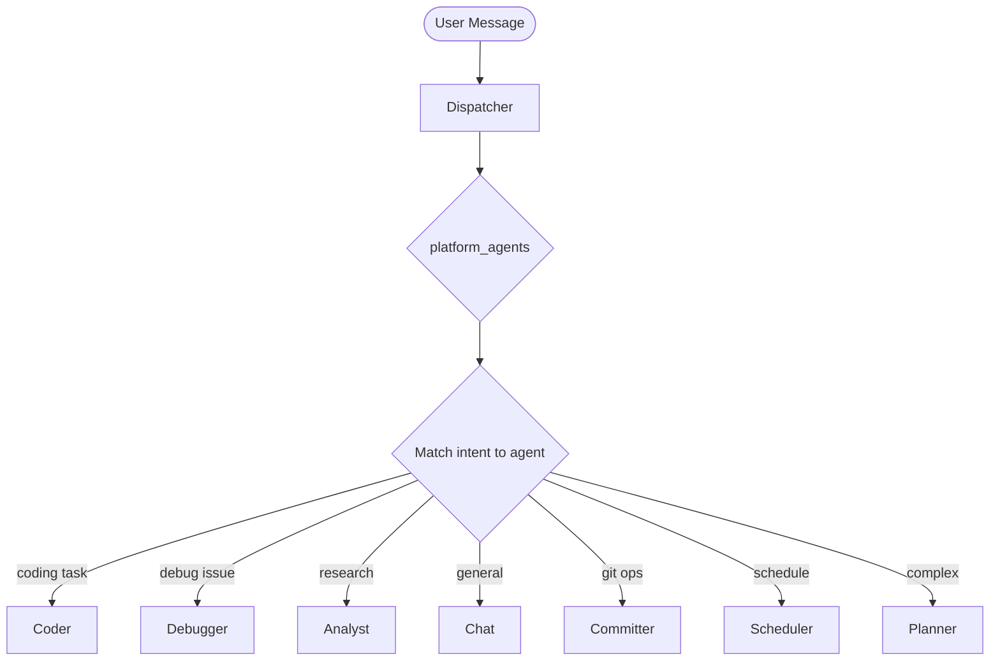

# Multi-Agent System

Meept uses a multi-agent architecture where specialist agents handle different types of tasks. A dispatcher classifies incoming requests and routes them to the most appropriate agent.

## Agent Types

### Roles

| Role | Description |
|------|-------------|
| `dispatcher` | Intake agent that classifies and routes requests |
| `executor` | Specialist agent that executes specific task types |
| `reviewer` | Validation agent that reviews and approves work |

### Executor Agents

| Agent ID | Purpose | Additional Tools |
|----------|---------|------------------|
| `chat` | General conversation | `web_fetch`, `web_search` |
| `coder` | File ops, shell, coding | `file_read`, `file_write`, `file_delete`, `list_directory`, `shell_execute` |
| `debugger` | Troubleshooting, bug fixing | `file_read`, `file_write`, `shell_execute` |
| `planner` | Task decomposition, planning | (baseline only) |
| `analyst` | Research, data analysis | `web_fetch`, `web_search` |
| `committer` | Git operations | `shell_execute` |
| `scheduler` | Job scheduling | `schedule_create`, `schedule_list`, `schedule_delete` |

### Reviewer Agents

| Agent ID | Reviews |
|----------|---------|
| `code-reviewer` | Code changes from the coder agent |
| `test-reviewer` | Test results and verification |
| `debug-reviewer` | Debugging analysis and fixes |
| `analyst-reviewer` | Research and analysis work |
| `planner-reviewer` | Execution plans |

## Baseline Tools

All agents have access to these tools regardless of specialization:

| Tool | Description |
|------|-------------|
| `memory_store` | Store a memory |
| `memory_search` | Search memories |
| `memory_get_context` | Get relevant context |
| `task_create` | Create a task |
| `task_get` | Get task by ID |
| `task_list` | List tasks |
| `task_update` | Update a task |
| `platform_status` | Get system status |
| `platform_agents` | List available agents |
| `platform_tools` | List registered tools |
| `delegate_task` | Route task to specific agent |

## Agent Constraints

Each agent has operational limits:

| Constraint | Default | Description |
|------------|---------|-------------|
| `max_iterations` | 25 | Maximum reasoning cycles per request |
| `timeout` | 5m | Maximum duration per request |
| `max_tokens_per_turn` | 4096 | Maximum tokens to generate per turn |
| `max_memory_refs` | 20 | Maximum memory references to inject |

The dispatcher has tighter constraints (5 iterations, 60s timeout) since it only routes, doesn't execute.

## Agent Customization

### AGENT.md Files

Agents can be customized using `AGENT.md` files with YAML frontmatter:

```yaml
---
id: coder
name: Code Specialist
role: executor
additional_tools:
  - file_read
  - file_write
capabilities:
  - code
  - reasoning
max_iterations: 20
timeout_seconds: 600
temperature: 0.1
---
# Custom Coder Instructions
Always add type annotations. Prefer functional style.
```

### Discovery Hierarchy (highest priority first)

1. `.meept/agents/<id>/AGENT.md` — Project-local
2. `~/.meept/agents/<id>/AGENT.md` — User-global
3. `~/.config/meept/agents/<id>/AGENT.md` — System-wide
4. `config/agents/` — Bundled defaults

### Merge Behavior

- Non-empty AGENT.md fields **override** programmatic defaults
- Empty fields inherit from defaults
- Tools are **merged** (union), not replaced

### RULES.md

A global `RULES.md` can inject behavior requirements into all agents:

**Discovery:** `.meept/RULES.md` > `~/.meept/RULES.md` > embedded default

Rules require agents to return structured JSON reports:
```json
{
  "status": "completed|partial|failed|needs_input",
  "accomplished": ["what you completed"],
  "not_done": ["what remains"],
  "issues": ["problems encountered"],
  "suggested_next_agent": "agent-id",
  "user_decision_needed": true
}
```

## Coworker Awareness

Agents discover each other using platform tools:

- `platform_agents` — List all registered agents with capabilities
- `platform_status` — Get platform health and uptime
- `platform_tools` — List all registered tools
- `delegate_task` — Route a task to a specific agent

## Task Routing



## Dispatcher Feedback Loop

After an executor finishes, the dispatcher evaluates the structured report:

| Status | UserDecisionNeeded | SuggestedNextAgent | Action |
|--------|--------------------|--------------------|--------|
| completed | false | empty | Close task, notify user |
| completed | true | any | Notify user, await input |
| completed/partial | false | set | Route to suggested agent |
| partial/needs_input | true | — | Notify user, await input |
| failed | — | — | Notify user with error |

## Job Queue Routing

Jobs can target specific agents via `agent_id`:
- If `agent_id` is set, only that agent can claim the job
- If `agent_id` is empty, any agent with matching capabilities can claim
- Priority levels: low, normal, high, urgent

See [Multi-Agent Orchestration](../workflows/agent-orchestration.md) for the full workflow specification.
