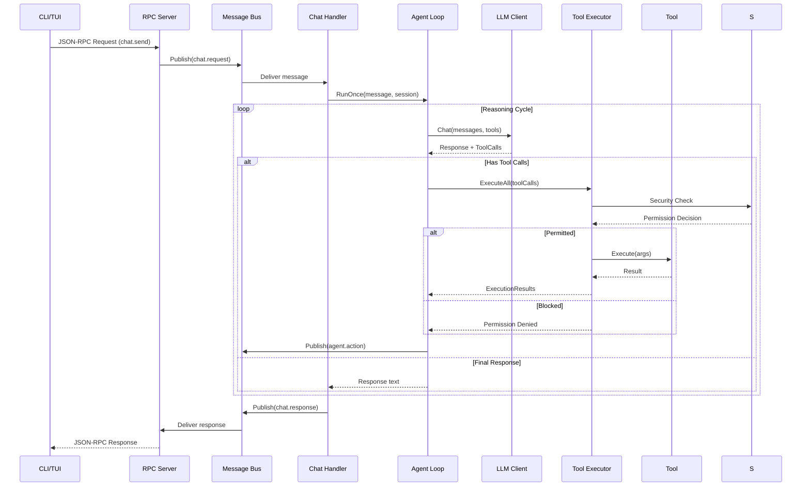
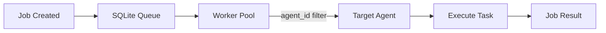

# Request Flow

How a message travels through the Meept system from user input to response.

## Synchronous Flow (Chat)

The most common path: user sends a message through the CLI/TUI.



## Step-by-Step Breakdown

### 1. Client Request

The CLI or TUI sends a JSON-RPC request over a Unix socket:

```json
{
  "jsonrpc": "2.0",
  "method": "chat.send",
  "params": {
    "message": "What files are in this directory?",
    "session_id": "abc123"
  },
  "id": 1
}
```

### 2. Message Bus Routing

The RPC server publishes a `chat.request` event on the message bus. Subscribers receive the message based on topic matching.

### 3. Agent Loop

The agent loop runs through reasoning cycles:

1. **Memory injection** — Relevant memories are fetched and added to the context
2. **LLM call** — Messages + tools are sent to the LLM
3. **Response evaluation** — If the LLM requests tool calls, execute them
4. **Tool execution** — Each tool call goes through permission checks, then executes
5. **Iteration** — Tool results are fed back to the LLM
6. **Final response** — When the LLM returns text (no tool calls), the cycle ends

### 4. Dispatcher Routing

If multi-agent mode is enabled, the dispatcher first classifies the message:

1. Calls `platform_agents` to discover available specialists
2. Matches the user's intent to an agent's purpose
3. Uses `delegate_task` to route to the best agent
4. The target agent executes the actual work

### 5. Response Delivery

The response travels back through the bus → RPC → client.

## Asynchronous Flow (Job Queue)

For scheduled or delegated work, jobs go through the queue:



### Bus Topics (Key Events)

| Topic | Publisher | Payload |
|-------|-----------|---------|
| `chat.request` | RPC handler | User chat input |
| `chat.response` | Agent loop | Agent response |
| `agent.action` | Tool executor | Tool call results |
| `task.create` | RPC proxy | Task creation |
| `task.result` | Agent loop | Task completion |
| `selfimprove.status` | Controller | Improvement cycle phase |
| `scheduler.reminder` | Scheduler | Reminder message |

## Error Handling

| Error Type | Behavior |
|------------|----------|
| LLM timeout | Retry with exponential backoff |
| LLM rate limit | Respect `Retry-After` header, pause requests |
| Permission denied | Return error to agent, agent may adapt |
| Tool not found | Return error to agent |
| Max iterations reached | Return partial response with context |
| Budget exceeded | Stop processing, return budget error |

See [Dynamic Tool Routing](../workflows/tool-routing.md) for details on how tools are selected and executed.
