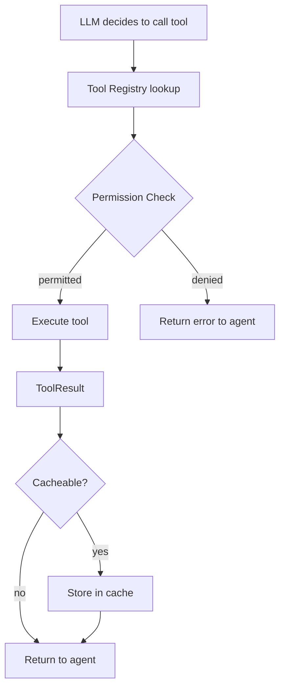

# Tools

Tools are the mechanism by which LLM agents interact with the system. Each tool defines a name, description, JSON Schema parameters, and an execute function.

## Tool Interface

Every tool implements the `Tool` interface:

```go
type Tool interface {
    Name() string                              // Unique identifier (snake_case)
    Description() string                       // Human-readable description for LLM
    Parameters() llm.FunctionParameters        // JSON Schema parameters
    Execute(ctx context.Context, args map[string]any) (any, error)
}
```

## Tool Registry

The tool registry manages tool registration and lookup:

- Tools are registered at daemon startup
- Each agent gets a subset of tools (baseline + additional)
- The LLM sees tool names and descriptions to decide when to use them

## Built-in Tools

### File Operations

| Tool | Description | Risk |
|------|-------------|------|
| `file_read` | Read file contents | Low |
| `file_write` | Write/create files | Medium |
| `file_delete` | Delete files | High |
| `list_directory` | List directory contents | Low |

### Shell & Execution

| Tool | Description | Risk |
|------|-------------|------|
| `shell_execute` | Run shell commands (60s timeout) | High |

### Web & Search

| Tool | Description | Risk |
|------|-------------|------|
| `web_fetch` | HTTP fetch (30s timeout, 100KB limit) | Medium |
| `web_search` | DuckDuckGo search (no API key needed) | Low |

### Memory

| Tool | Description | Risk |
|------|-------------|------|
| `memory_store` | Store a memory | Low |
| `memory_search` | Search memories | Low |
| `memory_get_context` | Get relevant context | Low |

### Tasks

| Tool | Description | Risk |
|------|-------------|------|
| `task_create` | Create a task | Low |
| `task_get` | Get task by ID | Low |
| `task_list` | List tasks | Low |
| `task_update` | Update a task | Low |

### Platform

| Tool | Description | Risk |
|------|-------------|------|
| `platform_status` | Get system status | Low |
| `platform_agents` | List available agents | Low |
| `platform_tools` | List registered tools | Low |
| `delegate_task` | Route task to agent | Low |

### Scheduling

| Tool | Description | Risk |
|------|-------------|------|
| `schedule_create` | Create scheduled job | Medium |
| `schedule_list` | List scheduled jobs | Low |
| `schedule_delete` | Delete scheduled job | Medium |

### Knowledge Graph

| Tool | Description | Risk |
|------|-------------|------|
| `entity_create` | Create graph nodes | Low |
| `entity_link` | Link entities | Low |
| `entity_query` | Query related entities | Low |
| `graph_stats` | Graph statistics | Low |

### Code Intelligence

| Tool | Description | Risk |
|------|-------------|------|
| `ast_parse` | Parse source file with tree-sitter | Low |
| `ast_symbols` | Extract symbols from parsed AST | Low |
| `ast_query` | Query AST nodes with pattern | Low |
| `lsp_goto_definition` | Go to symbol definition | Low |
| `lsp_find_references` | Find all references to symbol | Low |
| `lsp_hover` | Get hover information | Low |
| `lsp_workspace_symbols` | Search workspace symbols | Low |
| `lsp_diagnostics` | Get LSP diagnostics | Low |

## MCP (Model Context Protocol)

Meept supports MCP for external tool integration:

### Configuration

```toml
[mcp]
enabled = false
config_file = "~/.meept/mcp_servers.json"
```

### MCP Server Configuration (`mcp_servers.json`)

```json
{
  "servers": [
    {
      "name": "filesystem",
      "type": "stdio",
      "command": ["npx", "-y", "@modelcontextprotocol/server-filesystem", "/home/user"]
    },
    {
      "name": "remote-api",
      "type": "http",
      "url": "https://mcp.example.com/api",
      "headers": {"Authorization": "Bearer ${MCP_API_KEY}"}
    }
  ]
}
```

### Transport Types

| Type | Description | Use Case |
|------|-------------|----------|
| `stdio` | Launch process, communicate via stdin/stdout | Local tools, CLI wrappers |
| `http` | HTTP-based communication | Remote MCP servers |

## Tool Execution Flow



## Tool Result Format

```go
type ToolResult struct {
    Success bool   `json:"success"`
    Result  any    `json:"result,omitempty"`
    Error   string `json:"error,omitempty"`
}
```

## Tool Caching

Read-only, idempotent tools can be cached to avoid redundant execution:

```toml
[agent.cache]
enabled = true
max_entries = 1000
default_ttl_seconds = 300
enabled_tools = [
    "file_read",
    "list_directory",
    "memory_search",
    "memory_get_context",
    "platform_status",
    "platform_agents",
    "platform_tools"
]
```

See [Dynamic Tool Routing](../workflows/tool-routing.md) for the full routing specification.
